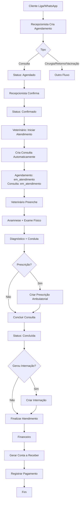
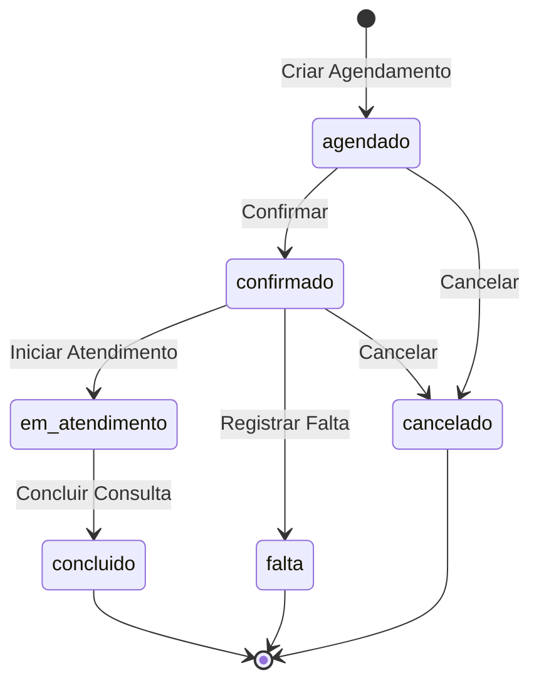
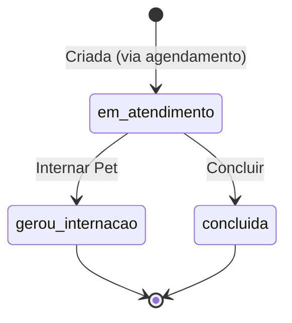
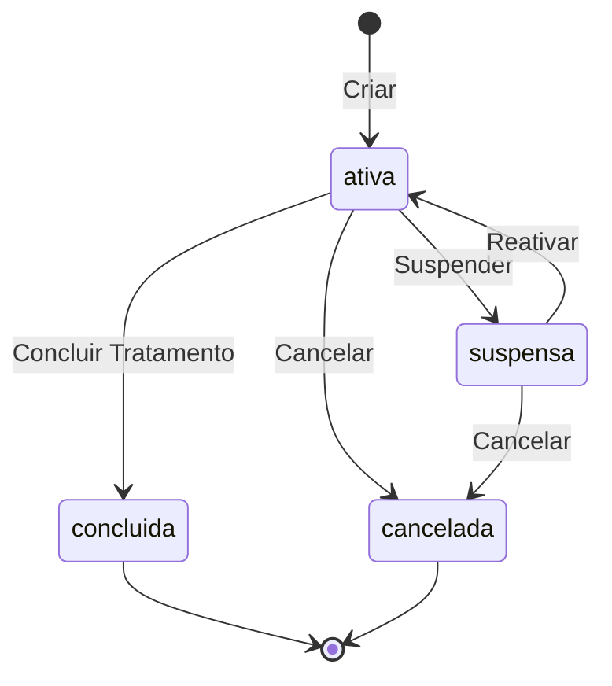
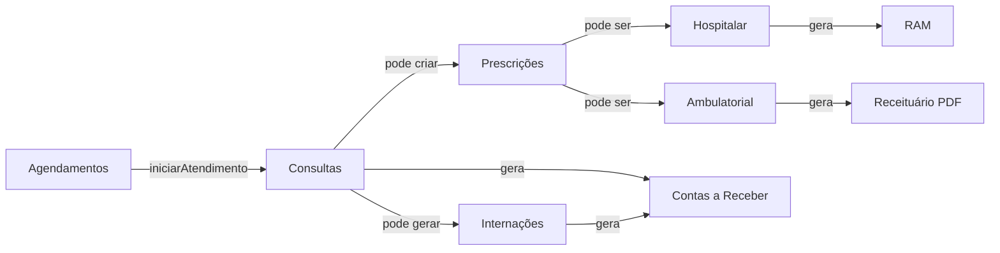

# 🏥 Workflow Ambulatorial - Zoa Pets

## Visão Geral

Este documento descreve o **fluxo completo de atendimento ambulatorial** implementado no sistema Zoa Pets, desde o primeiro contato do cliente até a emissão do receituário.

**Status:** ✅ Implementado
**Versão:** 1.0
**Data:** 2025-10-21

---

## Diagrama de Fluxo



---

## Fluxo Detalhado

### 1. Primeiro Contato

**Ator:** Cliente (Tutor do Pet)
**Meio:** Telefone, WhatsApp, Presencial

**O que acontece:**
- Cliente liga para a clínica
- Relata sintomas ou necessidade do pet
- Recepcionista verifica disponibilidade

---

### 2. Criação do Agendamento

**Ator:** Recepcionista
**Tela:** `/agendamentos`

**Campos Obrigatórios:**
- Pet (se não existir, cadastrar tutor + pet primeiro)
- Veterinário
- Data e hora
- Tipo: `consulta`
- Motivo

**API:**
```http
POST /api/agendamentos
Content-Type: application/json

{
  "petId": "uuid",
  "veterinarioId": "uuid",
  "dataHoraInicio": "2025-10-21T14:00:00Z",
  "dataHoraFim": "2025-10-21T14:30:00Z",
  "tipo": "consulta",
  "motivo": "Tosse e espirros há 3 dias",
  "observacoes": "Pet já vacinado"
}
```

**Status Inicial:** `agendado`

**Regras de Negócio:**
- ✅ Não permitir agendamento no passado
- ✅ Verificar conflito de horários do veterinário
- ✅ Pet deve estar ativo (não óbito)
- ✅ Duração padrão: 30 minutos (consulta)

---

### 3. Confirmação do Agendamento

**Ator:** Recepcionista
**Quando:** 1 dia antes ou no dia do atendimento

**API:**
```http
PATCH /api/agendamentos/:id/confirmar
```

**Mudanças:**
- `status`: `agendado` → `confirmado`
- `confirmadoEm`: timestamp atual

**Opcional:** Envio de lembrete ao tutor (WhatsApp/SMS)

---

### 4. Iniciar Atendimento

**Ator:** Veterinário
**Tela:** `/agendamentos` (botão "Iniciar Atendimento")

**Condições para o botão aparecer:**
```typescript
status === 'confirmado' && tipo.toLowerCase() === 'consulta'
```

**API:**
```http
PATCH /api/agendamentos/:id/iniciar-atendimento
```

**O que acontece automaticamente:**
1. Cria registro de **Consulta**
2. Vincula `agendamentoId` na consulta
3. Atualiza status do agendamento: `confirmado` → `em_atendimento`
4. Redireciona para `/consultas/:consultaId`

**Payload da Consulta criada:**
```json
{
  "petId": "uuid",
  "tutorId": "uuid",
  "veterinarioId": "uuid",
  "agendamentoId": "uuid",
  "tipo": "ambulatorial",
  "dataAtendimento": "2025-10-21T14:05:00Z",
  "queixaPrincipal": "Tosse e espirros há 3 dias",
  "status": "em_atendimento"
}
```

---

### 5. Consulta (Atendimento Clínico)

**Ator:** Veterinário
**Tela:** `/consultas/:id`

#### 5.1 Anamnese

**Campos:**
- ✅ Queixa Principal (preenchido automaticamente do agendamento)
- Histórico (evolução dos sintomas, histórico médico relevante)

#### 5.2 Exame Físico

**Campos Estruturados:**
- Temperatura (°C)
- Frequência Cardíaca (bpm)
- Frequência Respiratória (rpm)
- TPC (Tempo de Perfusão Capilar)
- Mucosas
- Hidratação
- Ausculta (textarea)
- Palpação (textarea)
- Observações do Exame Físico

#### 5.3 Diagnóstico e Conduta

**Campos:**
- Diagnóstico (textarea)
- Conduta (plano terapêutico)
- Orientações ao Tutor

**Botões:**
- 💾 "Salvar" (salva sem concluir, permite edição posterior)
- ✅ "Concluir Consulta" (finaliza o atendimento)

---

### 6. Prescrição Ambulatorial

**Ator:** Veterinário
**Tela:** `/consultas/:id` (seção "Prescrições Médicas")

**Quando:** Durante ou após preencher a consulta

**Botão:** "+ Nova Prescrição"

#### 6.1 Dialog de Criação

**Campos Gerais:**
- Data da Prescrição (padrão: hoje)
- Válida Até (padrão: +30 dias)
- Observações Gerais

#### 6.2 Adicionar Medicamentos

**Para cada medicamento:**
- Medicamento (select)
- Dose (ex: "1 comprimido", "5ml")
- Via de Administração (oral, intravenosa, tópica, etc.)
- Frequência (ex: "A cada 12 horas", "3x ao dia")
- Duração (dias)
- Horários (ex: ["08:00", "20:00"])
- Instruções Específicas

**Botão:** "Adicionar à Prescrição"

#### 6.3 Revisar e Criar

**Tela mostra:**
- Lista de medicamentos adicionados
- Botão para remover itens
- Botão "Criar Prescrição"

**API:**
```http
POST /api/prescricoes
Content-Type: application/json

{
  "petId": "uuid",
  "tipo": "ambulatorial",
  "consultaId": "uuid",
  "veterinarioId": "uuid",
  "dataPrescricao": "2025-10-21T14:20:00Z",
  "dataValidade": "2025-11-20T23:59:59Z",
  "observacoes": "Administrar após as refeições",
  "itens": [
    {
      "medicamentoId": "uuid",
      "dose": "1 comprimido",
      "viaAdministracao": "oral",
      "frequencia": "A cada 12 horas",
      "duracaoDias": 7,
      "horarios": ["08:00", "20:00"],
      "instrucoes": "Dar com comida"
    }
  ]
}
```

**Diferença Crítica:**
```typescript
if (tipo === 'ambulatorial') {
  // NÃO agenda administrações no sistema
  // Tutor administra em casa
} else if (tipo === 'hospitalar') {
  // Agenda administrações automaticamente (RAM)
}
```

---

### 7. Conclusão da Consulta

**Ator:** Veterinário
**Botão:** "Concluir Consulta"

**Confirmação:** "Deseja concluir esta consulta? Esta ação não pode ser desfeita."

**API:**
```http
PATCH /api/consultas/:id/concluir
```

**Mudanças:**
- `status`: `em_atendimento` → `concluida`
- Agendamento vinculado também atualiza: `em_atendimento` → `concluido`

**Redirecionamento:** `/consultas` (lista)

---

### 8. Receituário (PDF)

**Status:** 🚧 Em Desenvolvimento

**Funcionalidade Planejada:**
- Botão "Gerar Receituário" na consulta
- Template PDF profissional
- Informações: pet, tutor, veterinário (CRMV), prescrições
- Assinatura digital (opcional)
- Download ou envio por email/WhatsApp

---

### 9. Financeiro

**Ator:** Recepcionista/Financeiro
**Tela:** `/financeiro`

#### 9.1 Gerar Conta a Receber

**Pode ser gerado:**
- Automaticamente (ao concluir consulta)
- Manualmente (pela recepção)

**Itens:**
- Valor da consulta
- Procedimentos realizados
- Medicamentos vendidos
- Exames solicitados

#### 9.2 Registrar Pagamento

**Formas de pagamento:**
- Dinheiro
- Cartão
- Pix
- Convênio

**API:**
```http
POST /api/financeiro/pagamentos
```

---

## Estados e Transições

### Agendamento



### Consulta



### Prescrição



---

## Regras de Negócio

### Agendamentos

1. ✅ Não permitir agendamentos no passado
2. ✅ Verificar conflito de horários (mesmo veterinário)
3. ✅ Pet deve estar ativo
4. ✅ Veterinário deve estar ativo
5. ⚠️ Lembrete automático 24h antes (pendente)
6. ⚠️ Bloquear horário de almoço (pendente)

### Consultas

1. ✅ Apenas agendamentos `confirmado` + `tipo=consulta` podem gerar consulta
2. ✅ Agendamento só pode gerar UMA consulta
3. ✅ Consulta criada automaticamente vincula `agendamentoId`
4. ✅ Queixa principal copiada do motivo do agendamento
5. ✅ Consulta não pode ser editada após conclusão
6. ✅ Consulta pode gerar internação (se necessário)

### Prescrições Ambulatoriais

1. ✅ `tipo` = `ambulatorial`
2. ✅ Vinculada a `consultaId`
3. ✅ **NÃO gera administrações** (diferente de hospitalar)
4. ✅ Válida por 30 dias (configurável)
5. ✅ Apenas veterinários podem criar
6. ✅ Pode ser suspensa/cancelada
7. ⚠️ Gerar PDF de receituário (pendente)

### Prescrições Hospitalares

1. ✅ `tipo` = `hospitalar`
2. ✅ Vinculada a `internacaoId`
3. ✅ **Gera administrações automáticas** (RAM)
4. ✅ Agenda doses com horários precisos
5. ✅ Enfermagem aplica e registra

---

## Endpoints da API

### Agendamentos

```http
POST   /api/agendamentos                  # Criar
GET    /api/agendamentos                  # Listar todos
GET    /api/agendamentos/periodo?...      # Listar por período
GET    /api/agendamentos/:id              # Buscar um
PATCH  /api/agendamentos/:id              # Atualizar
PATCH  /api/agendamentos/:id/confirmar    # Confirmar
PATCH  /api/agendamentos/:id/iniciar-atendimento # Iniciar
PATCH  /api/agendamentos/:id/cancelar     # Cancelar
PATCH  /api/agendamentos/:id/falta        # Registrar falta
DELETE /api/agendamentos/:id              # Deletar
```

### Consultas

```http
POST   /api/consultas                     # Criar (raro - geralmente via agendamento)
GET    /api/consultas                     # Listar todas
GET    /api/consultas/:id                 # Buscar uma
PATCH  /api/consultas/:id                 # Atualizar
PATCH  /api/consultas/:id/concluir        # Concluir
DELETE /api/consultas/:id                 # Deletar
```

### Prescrições

```http
POST   /api/prescricoes                   # Criar
GET    /api/prescricoes                   # Listar todas
GET    /api/prescricoes?status=ativa      # Filtrar por status
GET    /api/prescricoes?petId=uuid        # Filtrar por pet
GET    /api/prescricoes/pet/:petId        # Buscar por pet
GET    /api/prescricoes/internacao/:id    # Buscar por internação
GET    /api/prescricoes/consulta/:id      # Buscar por consulta ✨
GET    /api/prescricoes/:id               # Buscar uma
PATCH  /api/prescricoes/:id               # Atualizar
PATCH  /api/prescricoes/:id/suspender     # Suspender
PATCH  /api/prescricoes/:id/reativar      # Reativar
DELETE /api/prescricoes/:id               # Deletar
```

---

## Exemplos de Payloads Completos

### Criar Agendamento

```json
{
  "petId": "550e8400-e29b-41d4-a716-446655440000",
  "veterinarioId": "660e8400-e29b-41d4-a716-446655440000",
  "dataHoraInicio": "2025-10-21T14:00:00.000Z",
  "dataHoraFim": "2025-10-21T14:30:00.000Z",
  "tipo": "consulta",
  "motivo": "Tosse e espirros há 3 dias, sem apetite",
  "observacoes": "Pet já vacinado. Tutor relata que começou após banho."
}
```

### Resposta de Iniciar Atendimento

```json
{
  "id": "770e8400-e29b-41d4-a716-446655440000",
  "petId": "550e8400-e29b-41d4-a716-446655440000",
  "tutorId": "440e8400-e29b-41d4-a716-446655440000",
  "veterinarioId": "660e8400-e29b-41d4-a716-446655440000",
  "agendamentoId": "880e8400-e29b-41d4-a716-446655440000",
  "tipo": "ambulatorial",
  "dataAtendimento": "2025-10-21T14:05:00.000Z",
  "queixaPrincipal": "Tosse e espirros há 3 dias, sem apetite",
  "status": "em_atendimento",
  "createdAt": "2025-10-21T14:05:00.000Z"
}
```

### Criar Prescrição Ambulatorial

```json
{
  "petId": "550e8400-e29b-41d4-a716-446655440000",
  "tipo": "ambulatorial",
  "consultaId": "770e8400-e29b-41d4-a716-446655440000",
  "veterinarioId": "660e8400-e29b-41d4-a716-446655440000",
  "dataPrescricao": "2025-10-21T14:20:00.000Z",
  "dataValidade": "2025-11-20T23:59:59.999Z",
  "observacoes": "Administrar os medicamentos após as refeições. Retorno em 7 dias.",
  "itens": [
    {
      "medicamentoId": "990e8400-e29b-41d4-a716-446655440000",
      "dose": "1 comprimido (250mg)",
      "viaAdministracao": "oral",
      "frequencia": "A cada 12 horas",
      "duracaoDias": 7,
      "horarios": ["08:00", "20:00"],
      "instrucoes": "Dar com comida. Não pular doses."
    },
    {
      "medicamentoId": "aa0e8400-e29b-41d4-a716-446655440000",
      "dose": "5ml",
      "viaAdministracao": "oral",
      "frequencia": "3 vezes ao dia",
      "duracaoDias": 5,
      "horarios": ["08:00", "14:00", "20:00"],
      "instrucoes": "Agitar antes de usar. Pode misturar com comida úmida."
    }
  ]
}
```

---

## Responsabilidades por Perfil

### Recepcionista

- ✅ Criar agendamentos
- ✅ Confirmar agendamentos
- ✅ Cancelar agendamentos
- ✅ Registrar faltas
- ✅ Visualizar agendamentos
- ❌ Iniciar atendimento
- ❌ Criar prescrições

### Veterinário

- ✅ Visualizar agendamentos
- ✅ Iniciar atendimento
- ✅ Preencher consulta
- ✅ Criar prescrições
- ✅ Concluir consulta
- ✅ Gerar receituário
- ⚠️ Criar agendamento (opcional)

### Enfermeiro

- ✅ Visualizar agendamentos
- ✅ Visualizar consultas
- ✅ Visualizar prescrições
- ❌ Criar prescrições
- ❌ Editar consultas

### Administrador/Gerente

- ✅ Todas as permissões acima
- ✅ Deletar registros
- ✅ Acessar relatórios

---

## Integrações entre Módulos



---

## Casos de Uso Principais

### UC-01: Agendar Consulta

**Ator:** Recepcionista
**Pré-condição:** Pet e tutor cadastrados
**Fluxo:**
1. Recepcionista acessa `/agendamentos`
2. Clica em "Novo Agendamento"
3. Seleciona pet, veterinário, data/hora
4. Preenche tipo (`consulta`) e motivo
5. Salva
6. Sistema cria agendamento com status `agendado`

### UC-02: Atender Consulta

**Ator:** Veterinário
**Pré-condição:** Agendamento confirmado
**Fluxo:**
1. Veterinário acessa `/agendamentos`
2. Identifica agendamento confirmado
3. Clica "Iniciar Atendimento"
4. Sistema cria consulta e redireciona
5. Veterinário preenche anamnese, exame físico, diagnóstico
6. Salva periodicamente
7. Cria prescrição (se necessário)
8. Clica "Concluir Consulta"
9. Sistema atualiza status para `concluida`

### UC-03: Prescrever Medicamento

**Ator:** Veterinário
**Pré-condição:** Consulta em atendimento
**Fluxo:**
1. Na tela da consulta, clica "Nova Prescrição"
2. Define validade (30 dias padrão)
3. Para cada medicamento:
   - Seleciona medicamento
   - Define dose, via, frequência
   - Adiciona horários
   - Adiciona instruções
   - Clica "Adicionar à Prescrição"
4. Revisa lista de medicamentos
5. Adiciona observações gerais
6. Clica "Criar Prescrição"
7. Sistema cria prescrição `ambulatorial` (sem RAM)

---

## Próximos Passos

### Funcionalidades Pendentes

1. 🚧 **Receituário PDF**
   - Biblioteca: pdfmake ou jsPDF
   - Template profissional
   - Logo da clínica
   - Assinatura digital

2. 🚧 **Lembretes Automáticos**
   - WhatsApp API
   - SMS
   - Email
   - Envio 24h antes do agendamento

3. 🚧 **Integração Financeira Automática**
   - Gerar conta a receber ao concluir consulta
   - Valores configuráveis por tipo de consulta

4. 🚧 **Relatórios**
   - Consultas por veterinário
   - Taxa de faltas
   - Tempo médio de atendimento

---

## Notas Técnicas

### Performance

- **Queries otimizadas:** Uso de `relations` em findOne para evitar N+1
- **Indexes:** Criados em `pet_id`, `veterinario_id`, `data_hora_inicio`
- **Paginação:** Implementada em listagens

### Segurança

- **RBAC:** Roles verificados em todos os endpoints
- **JWT:** Token com `tenantId` para multi-tenant
- **Validação:** DTOs com class-validator
- **Auditoria:** Logs de todas as ações

### Multi-Tenant

- **Schema-per-Tenant:** Cada hospital tem schema isolado
- **Middleware:** `TenantMiddleware` seta schema baseado no JWT
- **Isolamento total:** Impossível acessar dados de outro hospital

---

**Versão:** 1.0
**Data:** 2025-10-21
**Autores:** Equipe Zoa Pets
**Status:** ✅ Implementado
