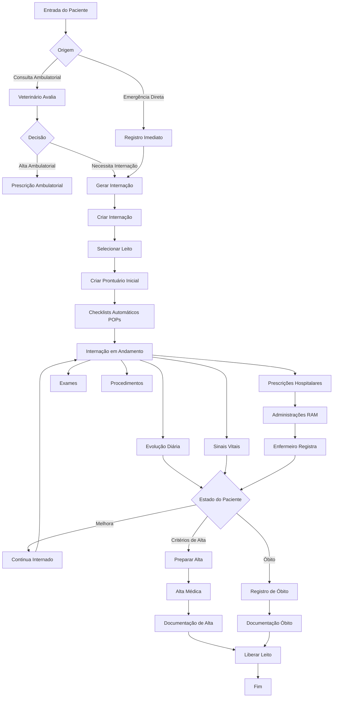

# 🏥 Workflow Hospitalar - Zoa Pets

## Visão Geral

Este documento descreve o **fluxo completo de internação hospitalar** implementado no sistema Zoa Pets, desde a entrada do paciente (via consulta ou emergência) até a alta médica, incluindo evolução diária, administração de medicamentos (RAM) e procedimentos.

**Status:** 🔨 Em Implementação (90% Backend, 70% Frontend)
**Versão:** 1.0
**Data:** 2025-10-21

---

## Diagrama de Fluxo Completo



---

## Fluxos Detalhados

### **FLUXO 1: Internação Via Consulta Ambulatorial**

#### Passo 1: Consulta Ambulatorial
**Ator:** Veterinário
**Tela:** `/consultas/[id]`

1. Veterinário atende pet em consulta
2. Preenche anamnese, exame físico, diagnóstico
3. Avalia necessidade de internação
4. Conclui consulta (status = 'concluida')

---

#### Passo 2: Gerar Internação
**Ator:** Veterinário
**Tela:** `/consultas/[id]` (após concluir)

1. Botão **"🏥 Gerar Internação"** aparece
2. Veterinário clica e preenche form

ário:
   - **Tipo:** Clínica / Cirúrgica / Urgência
   - **Prioridade:** Baixa / Média / Alta / Crítica
   - **Leito:** Ex: L-12
   - **Motivo:** (pré-preenchido com diagnóstico da consulta)

3. Sistema cria internação

**API:**
```http
POST /api/consultas/:id/gerar-internacao
{
  "tipo": "clinica",
  "prioridade": "alta",
  "leito": "L-12",
  "motivo": "Suspeita de pancreatite aguda. Requer hidratação IV e monitoramento."
}
```

**Backend:**
```typescript
// consultas.service.ts
async gerarInternacao(consultaId: string, dto: GerarInternacaoDto) {
  const consulta = await this.findOne(consultaId);

  // Criar internação
  const internacao = await this.internacoesRepository.save({
    petId: consulta.petId,
    medicoResponsavelId: consulta.veterinarioId,
    motivo: dto.motivo,
    diagnosticoInicial: consulta.diagnostico,
    tipo: dto.tipo,
    status: 'em_andamento',
    prioridade: dto.prioridade,
    leito: dto.leito,
    dataEntrada: new Date(),
  });

  // Vincular consulta → internação
  consulta.internacaoId = internacao.id;
  consulta.status = 'gerou_internacao';
  await this.consultasRepository.save(consulta);

  return internacao;
}
```

---

#### Passo 3: Sistema Cria Automaticamente

**Ao criar internação, sistema AUTOMATICAMENTE:**

1. **Cria primeira evolução clínica vazia**
   ```sql
   INSERT INTO evolucoes (internacao_id, data_hora, relato)
   VALUES (internacao.id, NOW(), 'Internação iniciada via consulta ambulatorial')
   ```

2. **Dispara checklists automáticos (se tipo específico)**
   - Se tipo = 'cirurgica' → Checklist "Pré-Operatório"
   - Se tipo = 'urgencia' → Checklist "Emergência"
   - Se isolamento = true → Checklist "Precauções de Isolamento"

3. **Notifica equipe de enfermagem**
   - Push notification para enfermeiros
   - Email para médico responsável

**Regras de Negócio:**
- Consulta deve estar concluída (status = 'concluida')
- Pet deve estar ativo (não óbito)
- Leito não pode estar ocupado (opcional, validar)

---

### **FLUXO 2: Internação Direta (Emergência)**

#### Sem Consulta Prévia

**Ator:** Veterinário, Recepcionista
**Tela:** `/internacoes` → "Nova Internação"

1. Cliente chega com emergência (sem agendamento)
2. Recepcionista ou veterinário registra internação diretamente
3. Preenche:
   - Pet (autocomplete ou cadastra na hora)
   - Tipo: Urgência/Emergência
   - Prioridade: Alta/Crítica
   - Motivo da internação
   - Leito disponível

4. Sistema cria internação (mesmo processo do Fluxo 1, passo 3)

**Diferença:** Não há consulta prévia vinculada.

---

### **FLUXO 3: Acompanhamento Durante Internação**

#### Visão Geral
**Tela Principal:** `/internacoes/[id]`

**Abas:**
1. **📋 Resumo** - Info geral, timeline de eventos
2. **📝 Evoluções** - Evolução clínica diária
3. **❤️ Sinais Vitais** - Monitoramento fisiológico
4. **💊 Prescrições** - Medicamentos hospitalares
5. **🔬 Exames** - Solicitações e resultados
6. **🏥 Procedimentos** - Cirurgias, curativos, etc.
7. **📋 Checklists** - POPs em execução

---

#### 3.1 Evolução Clínica Diária

**Ator:** Veterinário
**Frequência:** Pelo menos 1x ao dia (obrigatório)

**Tela:** Tab "Evoluções" → "Nova Evolução"

**Campos:**
- Data/Hora
- Relato narrativo (como está o paciente)
- Estado Geral: excelente, bom, regular, ruim, crítico
- Alimentação: normal, reduzida, não se alimentou
- Hidratação: normal, desidratado (leve/moderado/grave)
- Consciência: alerta, letárgico, estuporoso, comatoso
- Deambulação: normal, claudicante, decúbito
- Observações

**API:**
```http
POST /api/evolucoes
{
  "internacaoId": "uuid",
  "veterinarioId": "uuid",
  "dataHora": "2025-01-16T08:00:00Z",
  "relato": "Paciente apresentou melhora significativa nas últimas 24h. Aceitou alimentação espontaneamente pela primeira vez desde internação. Vômitos cessaram. Abdomen menos distendido à palpação.",
  "estadoGeral": "bom",
  "alimentacao": "normal",
  "hidratacao": "normal",
  "consciencia": "alerta",
  "deambulacao": "normal",
  "observacoes": "Manter hidratação IV por mais 24h. Considerar alta amanhã se mantiver melhora."
}
```

**Regras:**
- Obrigatório pelo menos 1 evolução por dia
- Sistema alerta se > 24h sem evolução
- Veterinário responsável deve assinar digitalmente (futuro)

---

#### 3.2 Sinais Vitais

**Ator:** Enfermeiro, Veterinário
**Frequência:** Conforme prescrição (ex: 6/6h, 12/12h)

**Tela:** Tab "Sinais Vitais" → "Registrar"

**Campos:**
- Data/Hora
- Temperatura (°C)
- Frequência Cardíaca (bpm)
- Frequência Respiratória (mpm)
- Pressão Arterial (Sistólica/Diastólica)
- Saturação O2 (%)
- Peso (kg)
- Glicemia (mg/dL)
- Observações

**API:**
```http
POST /api/sinais-vitais
{
  "internacaoId": "uuid",
  "veterinarioId": "uuid",
  "temperatura": 38.5,
  "frequenciaCardiaca": 120,
  "frequenciaRespiratoria": 32,
  "saturacaoOxigenio": 95,
  "peso": 12.5,
  "observacoes": "Pet agitado durante medição. FC pode estar artificialmente elevada."
}
```

**Frontend:**
- Gráficos de tendência (temperatura ao longo dos dias)
- Alertas se valores anormais

---

#### 3.3 Prescrições Hospitalares + RAM

**Ator:** Veterinário (prescreve), Enfermeiro (administra)

**PRESCREVER:**

**Tela:** Tab "Prescrições" → "Nova Prescrição Hospitalar"

**Campos:**
- Medicamento (autocomplete)
- Dose (ex: 10mg/kg)
- Via: IV, SC, IM, VO, Tópica
- Frequência: 6/6h, 8/8h, 12/12h, 24/24h, SOS
- Data Início
- Data Fim
- Observações

**API:**
```http
POST /api/prescricoes
{
  "tipo": "hospitalar",
  "petId": "uuid",
  "internacaoId": "uuid",
  "veterinarioId": "uuid",
  "dataPrescricao": "2025-01-16T10:00:00Z",
  "dataValidade": "2025-01-19T10:00:00Z",
  "itens": [
    {
      "medicamentoId": "uuid-amoxicilina",
      "dose": "20mg/kg",
      "viaAdministracao": "IV",
      "frequencia": "12/12h",
      "dataInicio": "2025-01-16T12:00:00Z",
      "dataFim": "2025-01-19T12:00:00Z",
      "observacoes": "Diluir em 50ml SF 0,9% e aplicar em 30 minutos"
    }
  ]
}
```

**Backend AUTOMATICAMENTE gera administrações:**
```typescript
// prescricoes.service.ts
async create(dto) {
  const prescricao = await this.save(dto);

  // Se hospitalar, gerar administrações
  if (dto.tipo === 'hospitalar') {
    for (const item of dto.itens) {
      const administracoes = this.gerarAdministracoes(item);
      await this.administracoesRepository.save(administracoes);
    }
  }
}

private gerarAdministracoes(item: PrescricaoItem) {
  const administracoes = [];
  const intervaloHoras = this.parseFrequencia(item.frequencia); // "12/12h" → 12

  let dataHora = item.dataInicio;
  while (dataHora <= item.dataFim) {
    administracoes.push({
      prescricaoItemId: item.id,
      dataHoraPrevista: dataHora,
      status: 'pendente',
    });
    dataHora = addHours(dataHora, intervaloHoras);
  }

  return administracoes;
}
```

---

**ADMINISTRAR (RAM):**

**Ator:** Enfermeiro
**Tela:** `/ram` (Painel de Enfermagem)

**Layout:**
```
🔴 ATRASADAS (3)
┌─────────────────────────────────────┐
│ Rex (L-12) - Amoxicilina 20mg/kg IV │
│ ⏰ Previsto: 12:00  Atraso: 2h      │
│ [REGISTRAR AGORA]                   │
└─────────────────────────────────────┘

🟡 PENDENTES (15)
🟢 PRÓXIMAS 2H (8)
```

**Ao clicar "Registrar":**
```http
PATCH /api/administracoes/:id/registrar
{
  "responsavelId": "uuid-enfermeiro",
  "dataHoraRealizada": "2025-01-16T14:05:00Z",
  "observacoes": "Aplicado sem intercorrências. Pet tolerou bem."
}
```

**Sistema:**
- Atualiza status: pendente → realizado
- Registra quem administrou
- Gera log de auditoria (CFMV)
- Remove da lista de pendentes
- Se atraso > 30min, registra ocorrência

---

### **FLUXO 4: Alta Médica**

#### Critérios de Alta

Veterinário avalia:
- Evolução clínica positiva (3 dias consecutivos sem piora)
- Sinais vitais estabilizados
- Alimentação e hidratação normais
- Não há mais necessidade de medicação IV
- Tutor está orientado e apto a dar continuidade em casa

---

#### Passo 1: Dar Alta

**Ator:** Veterinário
**Tela:** `/internacoes/[id]` → Botão "✅ Dar Alta"

**Dialog:**
```
┌─────────────────────────────────────┐
│ Alta Médica - Rex                   │
├─────────────────────────────────────┤
│ Data/Hora Alta: [YYYY-MM-DD HH:MM]  │
│                                     │
│ Diagnóstico Final:                  │
│ [Textarea]                          │
│                                     │
│ Condições de Alta:                  │
│ [ ] Alimentação normal              │
│ [ ] Hidratação adequada             │
│ [ ] Sinais vitais estáveis          │
│ [ ] Tutor orientado                 │
│                                     │
│ Orientações para Casa:              │
│ [Textarea - auto-preenchido]        │
│                                     │
│ Prescrição Ambulatorial:            │
│ [x] Sim [ ] Não                     │
│                                     │
│ Retorno em: [ 7 ] dias              │
│                                     │
│ [CANCELAR] [DAR ALTA]               │
└─────────────────────────────────────┘
```

**API:**
```http
PATCH /api/internacoes/:id/alta
{
  "dataSaida": "2025-01-18T14:00:00Z",
  "diagnostico": "Pancreatite aguda tratada com sucesso. Respondeu bem à fluidoterapia e jejum de 48h.",
  "observacoes": "Retornar imediatamente se voltar a vomitar. Manter dieta hipogordurosa por 15 dias. Retorno em 7 dias para reavaliação.",
  "prescricaoAmbulatorial": true,
  "retornoEm": 7
}
```

**Backend:**
```typescript
async darAlta(id: string, dto: AltaDto) {
  const internacao = await this.findOne(id);

  // Validações
  if (internacao.status !== 'em_andamento') {
    throw new BadRequestException('Internação não está ativa');
  }

  // Atualizar status
  internacao.status = 'alta';
  internacao.dataAlta = dto.dataSaida;
  internacao.diagnostico = dto.diagnostico;
  internacao.observacoes = dto.observacoes;

  await this.repository.save(internacao);

  // AUTOMATICAMENTE:
  // 1. Suspender prescrições hospitalares ativas
  await this.prescricoesService.suspenderPorInternacao(id);

  // 2. Liberar leito
  internacao.leito = null;

  // 3. Criar prescrição ambulatorial (se necessário)
  if (dto.prescricaoAmbulatorial) {
    await this.prescricoesService.create({
      tipo: 'ambulatorial',
      petId: internacao.petId,
      consultaId: null,
      veterinarioId: internacao.medicoResponsavelId,
      // ... medicamentos para casa
    });
  }

  // 4. Gerar documentos de alta
  await this.documentosService.gerarRelatorioAlta(internacao);

  return internacao;
}
```

---

#### Passo 2: Documentos de Alta

Sistema GERA automaticamente:

1. **Relatório de Alta Médica**
   - Resumo da internação
   - Diagnóstico final
   - Tratamentos realizados
   - Medicamentos administrados
   - Resultados de exames
   - Orientações para casa

2. **Receita Ambulatorial** (se houver)
   - Medicamentos para continuar em casa
   - Dosagem e instruções
   - Assinatura digital do veterinário

3. **Termo de Responsabilidade**
   - Tutor assina eletronicamente
   - Declara ciência das orientações

4. **Nota Fiscal / Recibo**
   - Valores da internação
   - Discriminativo de serviços

---

### **FLUXO 5: Registro de Óbito**

**Cenário:** Pet não responde ao tratamento e vem a óbito.

**Ator:** Veterinário
**Tela:** `/internacoes/[id]` → Botão "⚠️ Registrar Óbito"

**Dialog:**
```
┌─────────────────────────────────────┐
│ ⚠️ Registro de Óbito - Rex          │
├─────────────────────────────────────┤
│ Data/Hora Óbito: [YYYY-MM-DD HH:MM] │
│                                     │
│ Causa Mortis:                       │
│ [Textarea]                          │
│                                     │
│ Necropsia solicitada?               │
│ [ ] Sim [x] Não                     │
│                                     │
│ Tutor notificado?                   │
│ [x] Sim [ ] Não                     │
│                                     │
│ Observações:                        │
│ [Textarea]                          │
│                                     │
│ [CANCELAR] [CONFIRMAR ÓBITO]        │
└─────────────────────────────────────┘
```

**API:**
```http
PATCH /api/internacoes/:id/obito
{
  "observacoes": "Parada cardiorrespiratória às 03:15. Realizado protocolo de ressuscitação sem sucesso. Tutor presente e notificado.",
  "causaMortis": "Choque séptico secundário a peritonite",
  "necropsiaRequerida": false
}
```

**Backend:**
- Status → 'obito'
- dataAlta = data do óbito
- Suspende todas prescrições
- Libera leito
- Gera atestado de óbito
- Notifica tutor (se configurado)

---

## Integrações Entre Módulos

### Consultas ↔ Internações
- Consulta pode gerar internação
- Internação armazena ID da consulta origem
- Histórico completo: Agendamento → Consulta → Internação

### Prescrições ↔ Administrações (RAM)
- Prescrição hospitalar gera administrações automáticas
- Administrações vêm de itens de prescrição
- Enfermeiro registra em tempo real

### Internações ↔ Evoluções
- Evoluções documentam progresso diário
- Gráficos de evolução clínica
- Obrigatório pelo menos 1/dia

### Internações ↔ Sinais Vitais
- Monitoramento fisiológico contínuo
- Gráficos de tendência
- Alertas de valores anormais

### Internações ↔ Checklists (POPs)
- Checklists criados automaticamente por tipo
- Enfermeiro completa durante internação
- Rastreabilidade de conformidade

### Internações ↔ Financeiro
- Todos os serviços/medicamentos geram contas
- Ao dar alta, consolida valores
- Gera nota fiscal

---

## Casos de Uso Completos

### UC-001: Internação Via Consulta
1. Veterinário atende consulta ambulatorial
2. Diagnóstico: requer internação
3. Conclui consulta
4. Clica "Gerar Internação"
5. Preenche dados (tipo, prioridade, leito)
6. Sistema cria internação + evolução inicial + checklists
7. Redireciona para /internacoes/:id

### UC-002: Prescrever e Administrar
1. Veterinário acessa internação
2. Tab "Prescrições" → Nova
3. Seleciona Amoxicilina, 12/12h, 3 dias
4. Sistema gera 6 administrações automáticas
5. Enfermeiro abre Painel RAM
6. Vê dose pendente 12:00
7. Prepara e administra
8. Registra no sistema
9. Status → realizado

### UC-003: Evolução Diária + Alta
1. Veterinário acessa internação (manhã)
2. Tab "Evoluções" → Nova
3. Descreve estado do paciente
4. 3 dias consecutivos de melhora
5. Decide dar alta
6. Botão "Dar Alta"
7. Preenche diagnóstico final, orientações
8. Cria prescrição ambulatorial
9. Sistema gera documentos
10. Libera leito

---

## Diferenças Críticas: Ambulatorial vs Hospitalar

| Aspecto | 🏠 Ambulatorial | 🏥 Hospitalar |
|---------|----------------|---------------|
| **Origem** | Agendamento → Consulta | Consulta/Emergência → Internação |
| **Local** | Consultório | Leito hospitalar |
| **Duração** | 30-60min | Dias/semanas |
| **Prontuário** | Consulta (1x) | Evoluções diárias (Nx) |
| **Prescrição** | tipo='ambulatorial' | tipo='hospitalar' |
| **Administração** | Tutor em casa | Enfermeiro no hospital (RAM) |
| **Monitoramento** | Retornos agendados | Contínuo (sinais vitais) |
| **Documentação** | Receita impressa | Relatório de alta completo |
| **Referência** | consultaId | internacaoId |

---

## Regras de Negócio Consolidadas

### RN-H001: Criação de Internação
- Pode ser criada via consulta ou diretamente
- Pet deve estar ativo
- Médico responsável obrigatório
- Status inicial: 'em_andamento'

### RN-H002: Evolução Obrigatória
- Mínimo 1 evolução por dia
- Alerta se > 24h sem registro
- Veterinário responsável deve ser identificado

### RN-H003: Prescrições Hospitalares
- Sempre vinculadas a internação (internacaoId)
- Tipo DEVE ser 'hospitalar'
- Geram administrações (RAM) automaticamente

### RN-H004: Alta Médica
- Apenas veterinário pode dar alta
- Internação deve estar 'em_andamento'
- Prescrições ativas são suspensas
- Leito é liberado
- Documentos são gerados

### RN-H005: Registro de Óbito
- Apenas veterinário pode registrar
- Notificar tutor é obrigatório
- Gera atestado de óbito
- Libera leito imediatamente

---

## 📊 Métricas e KPIs

### Indicadores Hospitalares
- **Taxa de Ocupação:** (leitos ocupados / total) * 100
- **Tempo Médio de Internação:** Média de dias internado
- **Taxa de Óbito:** (óbitos / total internações) * 100
- **Taxa de Retorno:** % que retornou em < 7 dias

### Indicadores RAM
- **Aderência:** % administrações no horário
- **Taxa de Atraso:** % atrasadas > 30min
- **Não Realizações:** % marcadas como não realizadas

---

## Próximos Passos de Implementação

### Backend (Pendente)
- [ ] Endpoint POST /consultas/:id/gerar-internacao
- [ ] Lógica gerar administrações automáticas (prescricoes.service.ts)
- [ ] Endpoint GET /administracoes/painel-enfermagem
- [ ] Suspender prescrições ao dar alta
- [ ] Gerar documentos de alta

### Frontend (Pendente)
- [ ] Botão "Gerar Internação" em consultas/[id]
- [ ] Dialog com formulário de internação
- [ ] Tab "Prescrições" em internacoes/[id]
- [ ] Refatorar Painel RAM (/ram)
- [ ] Melhorias página detalhes internação
- [ ] Documentos de alta (visualização/download)

---

**Versão:** 1.0
**Data:** 2025-10-21
**Autor:** Equipe Técnica Zoa Pets
**Status:** ✅ Documentação Completa | 🔨 Implementação em Andamento
